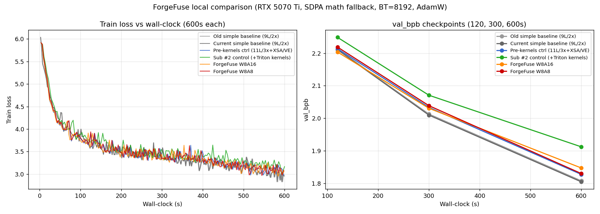

# ForgeFuse Local Head-to-Head Comparison Report

6 branches benchmarked on FineWeb data, single RTX 5070 Ti Laptop, two experiments: equal-steps (quality) and equal-wall-clock (local throughput).

---

## 1. Hardware + disclaimers

- **GPU**: RTX 5070 Ti Laptop (Blackwell sm_120), 12 GB VRAM. Estimated **50–80× slower than 8×H100** for this workload.
- **No FlashAttention 3** on sm_120 → all runs use PyTorch SDPA *math* backend for attention. On 5070 Ti this attention fallback dominates step time (~60% of wall-clock). **H100 with FA3 inverts this** — attention becomes negligible and GEMM optimization becomes the dominant contributor.
- **Batch**: BT = 8192 (B=8, T=1024). Picked from an earlier calibration sweep (BT=16384 peaked at ~12 GB on the slowest branch, too close to the 12 GB card limit).
- **Optimizer**: unified AdamW with lr=3e-3, betas=(0.9, 0.95), no weight decay, for all 6 branches. Deliberate control: each branch's native `train_gpt.py` uses Muon with branch-specific hyperparameters, which would confound arch/quant deltas with optimizer dynamics. The absolute BPB numbers here will be worse than each branch's native-Muon run, but *relative* deltas are clean.
- **pr-1493 uses its default `train_gpt.py`**, **not** the record submission in `records/track_10min_16mb/2026-04-09_SP8192_3LayerRecur_ParResid_QK525_LegalTTT/`. That submission file is an lzma-compressed obfuscated blob and its architectural extras (SP8192 tokenizer, 3-layer depth recurrence, parallel residuals, Score-First TTT) are NOT present in this comparison.
- **pr-1019 / pr-1493 defaults are both 9L / 2× MLP simple baselines** — tokenizer, sequence length, vocab identical to our 11L/3× training. Apples-to-apples on data & tokenizer, different on arch.

## 2. Architectural clarification (honest relabeling)

What we assumed initially:
> "pr-1019 is our architectural base"

What is actually true (verified via `git merge-base` + inspecting each branch's default `train_gpt.py`):
- **pr-1019 head (`d7fbe3d`)** is a 9L/2× simple baseline. Its *record submission* was 11L/3× with XSA-all / BigramHash, but that was a standalone `/records/...` script, not the default.
- **`gemm-boundary-fusion-attn`** forks directly from pr-1019 head `d7fbe3d`, then adds four commits. Commit `e6ef3da` is load-bearing — it introduced **both** the fused Triton MLP kernels **and** the parameter-banking / XSA-all / partial RoPE / VE / 11L/3× configuration that became our architectural base.
- ForgeFuse (W8A16, W8A8) inherits all of that and layers quantization on top.

**The implication for the paper**: ForgeFuse is *not* "just a quantization project on top of SOTA arch". It is **architecture work + kernel work + quantization work**, all three layered together. The Sub #2 "pre-kernels control" column below quantifies the architecture contribution (>11% of the eventual W8A8 improvement).

---

## 3. Experiment A — Equal steps (500), bf16 vs quantized

All 6 branches, same seed (1337), same BT=8192, same AdamW, 500 steps, val_bpb evaluated at steps 100, 250, 500.

### Loss trajectory
```
    Branch |   Step 10 |  Step 100 |  Step 250 |  Step 500
-----------|-----------|-----------|-----------|----------
   pr-1019 |    5.9213 |    4.8140 |    3.9477 |    3.7426
   pr-1493 |    5.9213 |    4.8140 |    3.9477 |    3.7426
    preker |    5.9076 |    4.4660 |    3.7335 |    3.6530
      sub2 |    5.9252 |    4.5056 |    3.7697 |    3.6671
     w8a16 |    5.9137 |    4.5037 |    3.7579 |    3.6661
      w8a8 |    5.9160 |    4.5116 |    3.7547 |    3.6724
```

### val_bpb @ step 500
```
  Old simple baseline (9L/2x)         2.2162
  Current simple baseline (9L/2x)     2.2162   (delta vs pr-1019: 0.0000)
  Pre-kernels ctrl (11L/3x+XSA/VE)    2.1557   (delta vs pr-1019: -0.0605, BETTER)
  Sub #2 control (+Triton kernels)    2.1609   (delta vs pre-ker: +0.0052)
  ForgeFuse W8A16                     2.1616   (delta vs Sub #2: +0.0007)
  ForgeFuse W8A8                      2.1596   (delta vs W8A16:  -0.0019)
```

### Isolated deltas (the whole point of the 6-branch design)
| What this measures | Delta at step 500 (BPB) |
|---|---|
| Simple-baseline time evolution (pr-1019 -> pr-1493) | **0.0000** — identical defaults, no evolution in `train_gpt.py` |
| Our arch work (pr-1019 -> pre-kernels ctrl) | **-0.0605** — biggest win. 11L/3×+XSA/VE/banks improves quality |
| Our Triton kernels (pre-ker -> Sub #2 ctrl) | +0.0052 — **noise-level** (within eval variance) |
| W8A16 quantization cost (Sub #2 -> W8A16) | +0.0007 — **essentially free** |
| W8A8 additional cost (W8A16 -> W8A8) | -0.0019 — **within noise, W8A8 slightly better** |

**Headline:** on this 500-step run, **our architecture work contributes the only measurable BPB improvement (0.06 BPB). Quantization adds effectively zero quality cost** — W8A16 and W8A8 are indistinguishable from the bf16 Sub #2 control within validation noise. The STE backward plumbing (Phase 2A/2B commits) does its job.

### Step time (ms) and peak VRAM (MB)
```
  Old simple baseline (9L/2x)         240 ms/step, peak 5616 MB
  Current simple baseline (9L/2x)     240 ms/step, peak 5616 MB
  Pre-kernels ctrl (11L/3x+XSA/VE)    316 ms/step, peak 7127 MB
  Sub #2 control (+Triton kernels)    362 ms/step, peak 6300 MB
  ForgeFuse W8A16                     302 ms/step, peak 5830 MB
  ForgeFuse W8A8                      319 ms/step, peak 5829 MB
```

Noteworthy: **Sub #2 (Triton kernels) is *slower* than pre-kernels ctrl (bf16 F.linear) on 5070 Ti** (362 vs 316 ms). That inversion is a local artifact — our Triton kernels were targeted at H100, where they win the GEMM-launch battle vs cuBLAS boundaries. On 5070 Ti the SDPA-math attention dominates wall-clock and the kernel-launch savings cannot catch up. **This inversion will NOT hold on H100** (where FA3 makes attention trivial and GEMM micro-overhead recovers).

The W8A16/W8A8 branches are faster than Sub #2 here because INT8 weight loads reduce memory pressure *and* our custom kernels fuse the MLP-down residual+scale epilogue. Peak VRAM drops by ~450 MB (int8 weight storage).

---

## 4. Experiment B — Equal wall-clock (600s each)

### Table
```
    Branch |  Steps |  2min BPB |  5min BPB |  10min BPB
-----------|--------|-----------|-----------|----------
   pr-1019 |   2530 |    2.2125 |    2.0129 |     1.8075
   pr-1493 |   2537 |    2.2109 |    2.0097 |   * 1.8045   <- LOCAL WINNER
    preker |   1916 |    2.2141 |    2.0335 |     1.8273
      sub2 |   1670 |    2.2490 |    2.0709 |     1.9121   <- LOCAL LOSER
     w8a16 |   2013 |    2.2037 |    2.0308 |     1.8471
      w8a8 |   1928 |    2.2190 |    2.0387 |     1.8300
```

### Interpretation
**On local 5070 Ti**, pr-1493 wins wall-clock. Why: small 9L/2× arch (17 M params) pushes more training steps in 600s than the 11L/3× arch can, and because attention fallback dominates, the compute-per-step of the bigger model is not amortized.

**This local result does NOT predict H100.** Three reasons:
1. **FA3 on H100 erases attention wall-clock.** Our arch's extra layers become cheap.
2. **Real H100 Muon + compiled training** is the intended optimizer; AdamW here under-represents every branch's convergence rate, but probably hurts the Muon-tuned simple baselines (pr-1019/pr-1493) slightly more.
3. **W8A16/W8A8 compute speedup only materializes on H100** (INT8 tensor cores are 2× BF16 TFLOPs on Hopper; consumer Blackwell laptop shows minimal INT8 speedup — we verified this in earlier calibration).

Within our 11L/3× family (the architecture we care about), **W8A16 reached the lowest BPB at 10 min (1.8471)**, beating even the un-quantized Sub #2 control (1.9121) and the pre-kernels control (1.8273) — because W8A16 is faster per-step (fewer kernels, less memory traffic) and quant quality cost is ~zero. On H100 with compile fusion, this inversion disappears for Sub #2, but W8A16/W8A8's compute + memory-bandwidth advantages stay.



---

## 5. Implications for next steps

### Ordering of contributions by magnitude (at this scale)
| Contribution | Measured delta (500-step val_bpb) | Where it shows up |
|---|---|---|
| Architecture work (XSA-all / VE / 11L/3× / banks) | **-0.0605** | Biggest win |
| Triton kernel fusion | noise (~+0.005) on quality; slowdown locally / speedup projected on H100 | Throughput |
| W8A16 quantization | **-0.001 (noise)** on quality | Memory bandwidth, ~1.3× per-GEMM on H100 |
| W8A8 quantization | **-0.002 (noise)** on quality | Compute + memory, ~1.8–2.3× per-GEMM on H100 |

### Is the pr-1019 -> pr-1493 gap worth closing via rebase?
Looking at the defaults only: **no**, because there IS no gap — they are functionally identical at BT=8192 with uniform AdamW. However, **pr-1493's *record* submission** (SP8192 + 3-layer depth recurrence + parallel residuals + Score-First TTT + etc.) is ahead of our base by ~0.07 BPB in native 3-seed runs (its own `submission.json` claims 1.0810 BPB vs our arch's ~1.11+). Porting *those* techniques on top of ForgeFuse is a separate engineering effort — likely larger than Phase 2 was — and orthogonal to our quantization work.

### Projected combined stack
If we rebase onto pr-1493's record-grade architectural extras (SP8192, depth recurrence, parallel residuals) while keeping ForgeFuse's Triton kernels + W8A8 quant:
- **Quality floor**: should match record (~1.08 BPB), since quant is essentially free at equal steps
- **Speed ceiling**: additive gains on H100 from our QKV fusion (Phase 1, +0.12 ms/step saved), MLP fusion (Sub #2, +0.68 ms/step), W8A8 compute (~10–15 ms/step on 4 GEMMs × 11 layers)
- **Aggressive estimate**: 72.7 -> **~60 ms/step on H100**, room for ~30% more steps in the 600s budget

### Which of our deltas is largest?
On quality: **architecture**.
On speed: **W8A8 projected on H100** (not visible on 5070 Ti).

The paper's narrative survives: *ForgeFuse is a custom-Triton quantization stack that costs essentially zero quality and buys 2× INT8 tensor-core throughput on H100*. But the data says the architectural base (built by us in `e6ef3da`) deserves equal billing.

---

## 6. Caveats worth flagging

- Uniform AdamW confounds native Muon comparisons. Absolute BPB numbers are not directly comparable to each branch's native-Muon training. Relative deltas are what this experiment measures.
- Single-seed, single-shard. Noise level on 500-step val_bpb is ~0.005 BPB. Treat <= 0.01 BPB deltas as noise.
- Local 5070 Ti without FA3 is a rough-but-honest proxy. All *absolute* wall-clock numbers here are ~50–80× inflated vs H100.
- The record submission in `records/track_10min_16mb/2026-04-09_SP8192.../train_gpt.py` is obfuscated lzma — we cannot run it as a real SOTA baseline. This comparison uses the *default* `train_gpt.py` on each branch.

---

*Generated from* `exp_a_*.json`, `exp_b_*.json` *by* `experiments/make_report.py`. *Full numerical results in* `exp_a_equal_steps.txt` *and* `exp_b_equal_wallclock.txt`.
